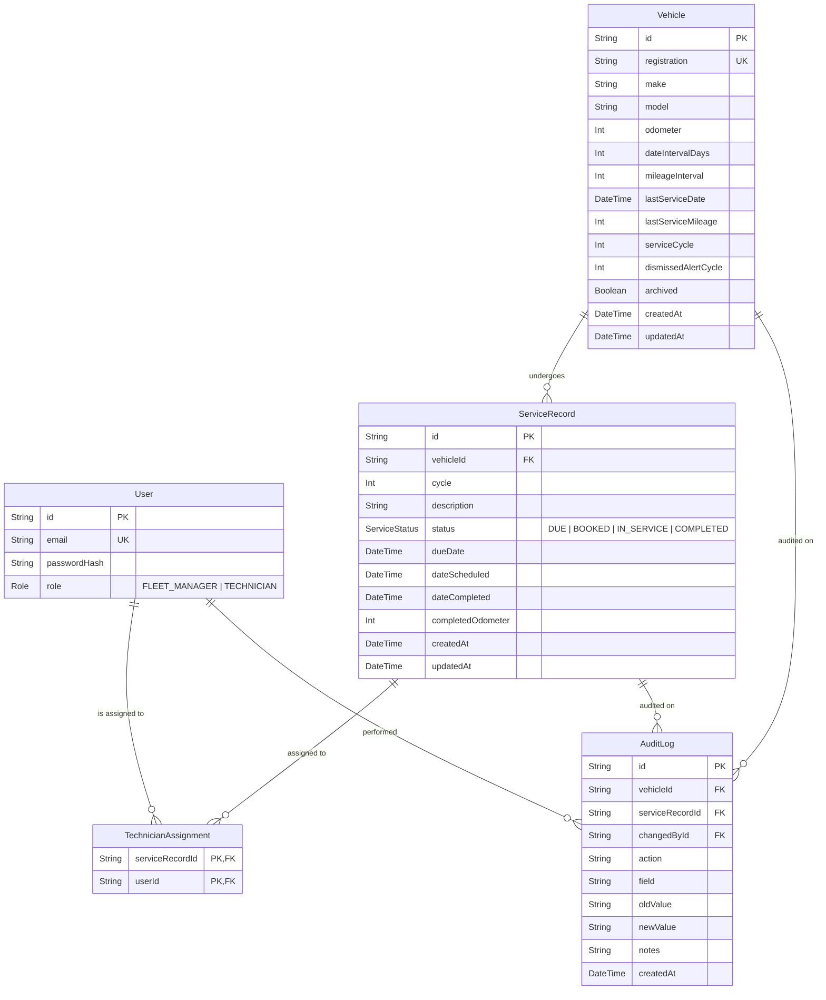

# Fleet Maintenance Database Schema Specification

This document details the database architecture, schema models, relations, indexes, and migration history for the Fleet Maintenance System.

---

## 1. Entity Relationship Diagram (ERD)

---

## 2. Models & Field Specifications

### 2.1 `User`
Stores user identities, credentials, and organizational roles.
* `id` (`String`, UUID, Primary Key): Unique identifier.
* `email` (`String`, Unique): User email address used for login.
* `passwordHash` (`String`): Bcrypt salted hash (cost factor 10).
* `role` (`Role` enum): `FLEET_MANAGER` or `TECHNICIAN`.

### 2.2 `Vehicle`
Represents an asset in the fleet and holds maintenance interval baselines and cycle counters.
* `id` (`String`, UUID, Primary Key): Unique identifier.
* `registration` (`String`, Unique): Vehicle registration or license plate.
* `make` (`String`), `model` (`String`): Manufacturer and model.
* `odometer` (`Int`): Current recorded odometer mileage.
* `dateIntervalDays` (`Int`): Maximum days permitted between scheduled services.
* `mileageInterval` (`Int`): Maximum mileage permitted between scheduled services.
* `lastServiceDate` (`DateTime`, Default `now()`): Baseline timestamp of the last completed service.
* `lastServiceMileage` (`Int`, Default `0`): Baseline odometer reading of the last completed service.
* `serviceCycle` (`Int`, Default `1`): Current maintenance cycle counter for the vehicle.
* `dismissedAlertCycle` (`Int`, Default `0`): Records the maintenance cycle for which overdue alerts were dismissed by a manager.
* `archived` (`Boolean`, Default `false`): Flags decommissioned or retired vehicles.

### 2.3 `ServiceRecord`
Represents an individual maintenance service ticket.
* `id` (`String`, UUID, Primary Key): Unique identifier.
* `vehicleId` (`String`, Foreign Key $\to$ `Vehicle.id`): Associated vehicle.
* `cycle` (`Int`, Default `1`): Maintenance cycle during which this service was instantiated.
* `description` (`String`): Service summary or scope of work.
* `status` (`ServiceStatus` enum): `DUE`, `BOOKED`, `IN_SERVICE`, or `COMPLETED`.
* `dueDate` (`DateTime`, Nullable): Calculated canonical due date or manual manager creation timestamp.
* `dateScheduled` (`DateTime`, Nullable): Scheduled appointment timestamp (mandatory when booking).
* `dateCompleted` (`DateTime`, Nullable): Recorded when work transitions to `COMPLETED`.
* `completedOdometer` (`Int`, Nullable): Final odometer reading recorded at service completion ($\ge$ current vehicle odometer).

### 2.4 `TechnicianAssignment`
Join model enabling many-to-many relationships between service records and technicians.
* `serviceRecordId` (`String`, Foreign Key $\to$ `ServiceRecord.id`).
* `userId` (`String`, Foreign Key $\to$ `User.id`).
* Primary Key: Composite `[serviceRecordId, userId]`.

### 2.5 `AuditLog`
Append-only immutable audit trail capturing state changes, technician assignments, and alert dismissals.
* `id` (`String`, UUID, Primary Key): Unique identifier.
* `vehicleId` (`String`, Nullable, Foreign Key $\to$ `Vehicle.id`).
* `serviceRecordId` (`String`, Nullable, Foreign Key $\to$ `ServiceRecord.id`).
* `changedById` (`String`, Nullable, Foreign Key $\to$ `User.id`): User who executed the action.
* `action` (`String`): Audit action identifier (e.g. `'SERVICE_CREATED'`, `'SERVICE_BOOKED'`, `'SERVICE_COMPLETED'`, `'TECHNICIAN_ASSIGNED'`, `'ALERT_DISMISSED'`).
* `field` (`String`): Field modified (e.g. `'status'`, `'assignments'`, `'dismissedAlertCycle'`).
* `oldValue` (`String`, Nullable), `newValue` (`String`, Nullable): Previous and new serialized values.
* `notes` (`String`, Nullable): Human-readable context and metadata.
* `createdAt` (`DateTime`, Default `now()`): Immutable creation timestamp.

---

## 3. Maintenance Cycle & Baseline Architecture

### Baseline Shifts
When a service record transitions from `IN_SERVICE` to `COMPLETED`:
1. `Vehicle.odometer` is updated to `completedOdometer`.
2. `Vehicle.lastServiceMileage` is reset to `completedOdometer`.
3. `Vehicle.lastServiceDate` is reset to `dateCompleted`.
4. `Vehicle.serviceCycle` is incremented:
   $$\text{serviceCycle}_{\text{new}} = \text{serviceCycle}_{\text{old}} + 1$$

Subsequent maintenance evaluations compute thresholds strictly against these updated baselines:
$$\text{Next Date Threshold} = \text{lastServiceDate} + \text{dateIntervalDays}$$
$$\text{Next Mileage Threshold} = \text{lastServiceMileage} + \text{mileageInterval}$$

### `dismissedAlertCycle` Mechanics
* Default value on creation: `0`.
* When a Fleet Manager dismisses an overdue alert on vehicle $V$ currently in cycle $C$:
  $$\text{Vehicle.dismissedAlertCycle} = C$$
* Alert Visibility Rule:
  $$\text{Visible} \iff \text{isOverdue} = \text{true} \land \text{Vehicle.dismissedAlertCycle} \neq \text{Vehicle.serviceCycle}$$
* When service completes and cycle advances to $C + 1$, `dismissedAlertCycle` remains $C$. Thus, in cycle $C + 1$:
  $$\text{dismissedAlertCycle } (C) \neq \text{serviceCycle } (C + 1)$$
  A future overdue service in cycle $C + 1$ automatically surfaces as an active alert without requiring manual reset scripts or background jobs.

---

## 4. Actual Database Indexes

The indexes configured in [`backend/prisma/schema.prisma`](file:///c:/Users/energ/Desktop/Busy_Dummy/backend/prisma/schema.prisma) directly support the application's search, filter, and pagination query patterns:

1. **`Vehicle`**:
   * `@unique([registration])`: Enforces unique license plates and accelerates single-vehicle lookup.
2. **`ServiceRecord`**:
   * `@@index([vehicleId, status])`: Optimizes vehicle-scoped service filtering (`GET /api/services/search?vehicleId=...&status=...`).
   * `@@index([status, updatedAt])`: Optimizes status filtering and sort orders.
   * `@@index([dateScheduled])`: Supports schedule lookups and sorting by appointment date.
3. **`TechnicianAssignment`**:
   * `@@id([serviceRecordId, userId])`: Composite primary key preventing duplicate technician assignments.
   * `@@index([userId])`: Optimizes technician-scoped service queries (`assignments: { some: { userId } }`).

---

## 5. Actual Migration History

The database schema has been applied through 3 tracked Prisma migrations in `backend/prisma/migrations/`:

1. **`0_init`**:
   Initial baseline schema defining `User`, `Vehicle`, `ServiceRecord`, `TechnicianAssignment`, and `AuditLog`.
2. **`20260903180500_add_maintenance_cycle_tracking`**:
   * Added `Vehicle.serviceCycle` (integer, default 1).
   * Added `Vehicle.dismissedAlertCycle` (integer, default 0).
   * Added `Vehicle.lastServiceMileage` (integer, default 0).
   * Added `Vehicle.lastServiceDate` (timestamp, default now).
   * Added `Vehicle.dateIntervalDays` (integer, default 90).
   * Added `Vehicle.mileageInterval` (integer, default 10000).
   * Added `ServiceRecord.cycle` (integer, default 1).
   * Backfilled existing vehicles and service records to establish consistent baseline cycles.
3. **`20260903193529_add_query_indexes`**:
   * Added index `ServiceRecord(vehicleId, status)`.
   * Added index `ServiceRecord(status, updatedAt)`.
   * Added index `ServiceRecord(dateScheduled)`.
   * Added index `TechnicianAssignment(userId)`.
